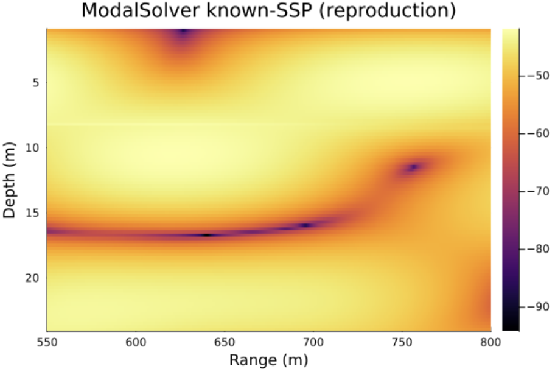

# Reproduction Test — Known SSP

This test reproduces the known-SSP field-estimation study from the paper using
the packaged solver. It trains a `ModeSolver` on the same measurement CSV and
compares the estimated field against the ground truth.

## How to run

From the folder containing `ModalSolver.jl`, `ssnn_profiles_1224.csv` and
`true_ssnn_ssp.csv`, start a fresh Julia REPL and run:

```julia
include("test_julia.jl")
```

The script (`test_julia.jl`):

```julia
include("ModalSolver.jl"); using .ModalSolver
using Statistics, Plots, CSV, DataFrames

ssp = load_ssp("true_ssnn_ssp.csv")
pm  = ModeSolver(D=25.0, f=500.0, ssp=ssp)
fit!(pm, "ssnn_profiles_1224.csv"; restarts=10, epochs=10000, log_every=500)

# field heatmap over the area of interest
ranges = 550.0:0.5:800.0
depths = 1.0:0.25:24.0
field  = predict_grid(pm, ranges, depths)

plt = heatmap(ranges, depths, 20 .* log10.(field); yflip=true,
              xlabel="Range (m)", ylabel="Depth (m)",
              title="ModalSolver known-SSP (reproduction)")
display(plt)
savefig(plt, "reproduction_known_ssp.png")

# RMSE on the measurement points
df   = CSV.read("ssnn_profiles_1224.csv", DataFrame)
pred = predict_amp(pm, df.range_m, df.depth_m)
println("Measurement-region RMSE = ",
        round(sqrt(mean((pred .- df.amp).^2)); sigdigits=4), " mVpp")
```

> **Note:** start a fresh REPL after any edit to `ModalSolver.jl` (or use
> [Revise.jl](https://github.com/timholy/Revise.jl)), otherwise the old module
> stays loaded and your changes will not take effect.

## Expected result

The script writes `reproduction_known_ssp.png` and prints the measurement-region
RMSE. The estimated field should show the interference band at ~15–17 m depth
curving upward toward the far range, matching the ground truth field.

### Estimated field

<!-- Insert your generated plot below. Put reproduction_known_ssp.png next to
     this file, or in an images/ folder and update the path. -->



*Estimated acoustic field (dB) over the area of interest, known-SSP case.*

## Notes

- Training uses random restarts, so the plot and RMSE vary slightly between
  runs. Use more `restarts` for a more robust result; the paper study used 10.
- Reducing `restarts` (e.g. to 2) is fine for quick checks but may give a
  slightly worse best-of-N field than the full run.
